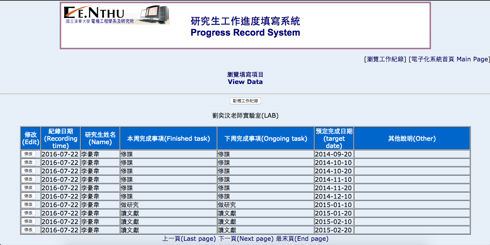
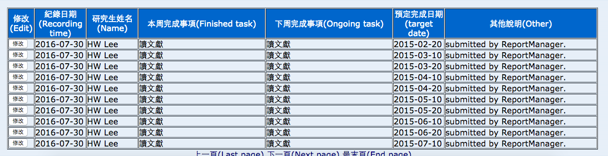
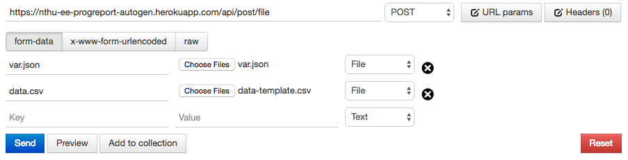

# 電機系研究生工作紀錄上傳系統

## 主要功能
請參考 [研究生工作進度填寫系統](http://emgt.ee.nthu.edu.tw/index.html)（須在清大網域下，登入以後選擇工作進度填寫系統）：


原始系統登錄的方法太過浪費時間，而且系上規定每個月至少兩筆，手動一筆一筆增加有點低能。故我想要用一個系統，讓大家能夠將其工作進度寫在 *Excel csv* 裡面：

| 本週完成事項 | 下週完成事項 | 月份 | 日期 | 年份 |
|--------|--------|-------|-------|-------|
| 讀文獻 | 讀文獻 | 1  | 10 | 2015 |
| 讀文獻 | 讀文獻 | 1  | 20 | 2015 |
| 讀文獻 | 讀文獻 | 2  | 10 | 2015 |
| 讀文獻 | 讀文獻 | 2  | 20 | 2015 |
| 讀文獻 | 讀文獻 | 3  | 10 | 2015 |
| 讀文獻 | 讀文獻 | 3  | 20 | 2015 |
| ..... | ..... | .. | .. | .... |
| 讀文獻 | 讀文獻 | 10 | 10 | 2015 |
| 讀文獻 | 讀文獻 | 10 | 20 | 2015 |
| 讀文獻 | 讀文獻 | 11 | 10 | 2015 |
| 讀文獻 | 讀文獻 | 11 | 20 | 2015 |
| 讀文獻 | 讀文獻 | 12 | 10 | 2015 |
| 讀文獻 | 讀文獻 | 12 | 20 | 2015 |

並且使用 terminal command `hwlee $ python submit.py`，就可以將此 csv 檔案的內容傳到系統上。

## 需求

### 終端機上傳
* Python 2.7
	* package: mechanize, json, csv, datetime（主要應該是 mechanize 要特別安裝）
* 清大 VPN 的帳號密碼（若直接在清大網域下則可免）
* 測試正確運作
	* Mac OSX（以此開發）

### RESTful API
* 串接能力（會需要寫程式執行 POST，任何可以透過網路通訊的語言都可以）

## 檔案架構
```
.
├── LICENSE
├── Procfile
├── README.md
├── app.py
├── data-template.csv                     <-- csv 範例
├── data.csv                              <-- 預設傳遞的 csv
├── figsrc
│   ├── postman-example.png
│   ├── prog-record-sys-screenshot.png
│   └── result-api.png
│   └── result.png
├── nthuee_prautogen
│   ├── __init__.py
│   ├── rpautogen.py                      <-- 開發的上傳管理模組
├── requirements.txt
├── runtime.txt
├── submit.py                             <-- 命令工具
└── var.json                              <-- 相關的私密參數
```

## 使用方法

### 本機端使用指令上傳

1. 更改 `var.json`

	```
	{
		"vpn-username": "YOUR_VPN_ACCOUNT",     <-- VPN帳號
    	"vpn-userpwd": "YOUR_VPN_PWD",          <-- VPN密碼
		"username": "YOUR_WORKSTATION_USRNAME", <-- 工作站帳號
		"userpwd": "YOUR_WORKSTATION_PWD",      <-- 工作站密碼
		"studentname": "YOUR_NAME"              <-- 你的真實姓名
	}
	```
	範例：
	
	```
	{
		"vpn-username": "s1030xxxxx@wlan.nthu.edu.tw",
		"vpn-userpwd": "ㄨㄛˇㄘㄞˊㄅㄨˊㄍㄠˋㄙㄨˋㄋㄧˋㄌㄟˊ",
		"username": "m1030xxxxx",
		"userpwd": "ㄨㄛˇㄘㄞˊㄅㄨˊㄍㄠˋㄙㄨˋㄋㄧˋㄌㄟˊ",
		"studentname": "HW Lee"
	}
	```
2. 將你的工作日誌整理成 `data.csv`
	
	範例：
	
	```
	本週完成事項, 下週完成事項, 月份, 日期, 年份
	FB 發文抱怨研究進度日誌, 寫一個自動程式不用一筆一筆智障新增, 7, 26, 2016
	完成此自動程式, 放上 github 供大家使用, 7, 30, 2016
	```
	
	在 *Excel* 下看起來會是這樣：
	
	| 本週完成事項 | 下週完成事項 | 月份 | 日期 | 年份 |
	|--------|--------|-------|-------|-------|
	| FB 發文抱怨研究進度日誌 | 寫一個自動程式不用一筆一筆智障新增 | 7 | 26 | 2016 |
	| 完成此自動程式 | 放上 github 供大家使用 | 7 | 30 | 2016
	
3. 在終端機上執行 `submit.py`，看到訊息即可知道是否成功

	```
	hwlee $ vi var.json
	hwlee $ vi data.csv
	hwlee $ python submit.py DATA_FILE_NAME[optional, default "data.csv"]
	Submit Success!
	hwlee $
	```
	
	成功以後會在網站上看到成果（以 `submit.py data-template.csv` 為例）：

	

	# 爽RRRRRRRRRRRRRRRRRRRRRR

### RESTful: Post single log
* SPEC
	* URL: [https://nthu-ee-progreport-autogen.herokuapp.com/api/post](https://nthu-ee-progreport-autogen.herokuapp.com/api/post)
	* form

	| fields       | value type | description | example |
	|--------------|------------|-------------|---------|
	| vpn-username | string | VPN帳號 | s1030xxxxx@wlan.nthu.edu.tw |
	| vpn-userpwd  | string |VPN密碼 | ㄨㄛˇㄘㄞˊㄅㄨˊㄍㄠˋㄙㄨˋㄋㄧˋㄌㄟˊ |
	| username     | string | 工作站帳號 | m1030xxxxx |
	| userpwd      | string | 工作站密碼 | ㄨㄛˇㄘㄞˊㄅㄨˊㄍㄠˋㄙㄨˋㄋㄧˋㄌㄟˊ |
	| studentname  | string | 姓名 | 煞氣ㄟHW |
	| thisweek     | string | 本週完成事項 | Web服務上線 |
	| nextweek     | string | 下週完成事項 | 領畢業證書囉^^ |
	| deadline     | string | 預計完成日期 | 2016-08-10 (yyyy-mm-dd) |
	
	* returns:
	
	```
	{
		"data-posted": true,      <-- 是否上傳成功
		"err-occur": false,       <-- 是否中途出錯
		"server-connected": true  <-- 是否連接成功
	}
	```
	
	* 成功新增

	
	
* 備註

	這個選擇主要是降低語言轉換之間的障礙，因此功能其實很陽春，只有一個接口且只能上傳單筆資料。目前在 heroku 上面的效能很差，不太建議使用這個 API。

### RESTful API: POST with files
* SPEC
	* URL: [https://nthu-ee-progreport-autogen.herokuapp.com/api/post/file](https://nthu-ee-progreport-autogen.herokuapp.com/api/post/file)
	* form

	| fields   | value type | description          |
	|----------|------------|----------------------|
	| var.json | file       | 同本機端使用的 var.json |
	| data.csv | file       | 同本機端使用的 data.csv |
	
	* chrom-extension **Postman** 介面使用如下

		[Postman 介紹](https://chrome.google.com/webstore/detail/postman-rest-client/fdmmgilgnpjigdojojpjoooidkmcomcm)
	
	
	
	* returns:
	
	```
	{
		"data-posted": true,      <-- 是否上傳成功
		"err-occur": false,       <-- 是否中途出錯
		"server-connected": true  <-- 是否連接成功
	}
	```

* 備註

	此 API 由於 heroku 免費帳戶的限制，效能其實滿差的，光是上傳 `data-template.csv` 就會超時導致 status code 不是 200。幸運的是，經過幾次實際測試，雖然會跳錯誤但仍會有大部份資料都有成功上傳，再去電機系系統上去檢查即可。謹慎上來說，建議上傳的檔案不要太大（可能就 `data-template.csv` 的一半就可以，這沒有實際測試）
	
### RESTful API hosted by localhost

為了解決速度極慢的問題，又想使用自己熟悉的語言且認識 RESTful 可以使用的解決方案。

* 需求
	* Python 2.7.9 (strictly)
	* pip
	* python package **"virtualenv"**

1. 將此 repo 下載到自己電腦

	```
	hwlee $ git clone https://github.com/HW-Lee/nthu-ee-progreport-autogen.git
	hwlee $ cd nthu-ee-progreport
	```

2. 設定好環境需求

	```
	hwlee $ virtualenv venv
	New python executable in /Users/HWLee/Documents/nthu-ee-progreport-autogen/venv/bin/python
	Installing setuptools, pip, wheel...done.
	hwlee $ source ./venv/bin/activate
	hwlee $ pip install -r requirements.txt
	```
	
3. 將網路服務在本機端開啟

	```
	hwlee $ python app.py
	* Running on http://0.0.0.0:5000/ (Press CTRL+C to quit)
	```
	
	如果有 heroku command line integration (cli) 則可以使用
	
	```
	hwlee $ heroku local web
	11:53:45 PM web.1 |   * Running on http://0.0.0.0:5000/ (Press CTRL+C to quit)
	```
	
4. 一樣使用 **Postman** ，但是 URL 改成 **localhost:5000/api/post/file**
	
5. 使用完畢，跳出虛擬環境

	```
	hwlee $ deactivate
	hwlee $ rm -rf ./venv
	```

## 作者的小抱怨

我前陣子才發了一篇 FB 文在抱怨這個詭異的制度，原先想要寫個長篇大論來說服系上停止這個制度，但後來想一下覺得寫一個自動化程式讓他們主動覺得這個制度很沒用好像是個更好的方法。

原先的動機是因為我的進度大概只填了幾個：

| 本週完成事項 | 下週完成事項 | 月份 | 日期 | 年份 |
|--------|--------|-------|-------|-------|
| 文獻回顧/修課 | 文獻回顧/修課 | 9 | 10 | 2014 |
| 將 matlab 實作移植 python | 繼續blabla | 12 | 10 | 2015 |
| 開發前處理 | 著手細部辨識 | 3 | 15 | 2016 |
| 完成細部辨識 | 寫論文 | 6 | 18 | 2016 |
| 改論文/安排口試 | 口試前準備 | 7 | 10 | 2016 |

之類的，然後被系辦說這樣太少。但其實我真的就文獻回顧跟修課滿長的一段時間，一時之間覺得要填一樣的東西填好幾筆很沒必要（一來我麻煩，二來審閱也麻煩）。再者，我覺得寫這個也沒什麼意義，被逼著寫莫名其妙心情就是不太好 ˋˊ。在使用系統的介面的時候，一次只能填一筆（一列），而沒辦法一次寫多筆，一筆一筆土炮的我就決定要來寫一個自動程式可以幫助處理這項浪費時間的行為。（我假設用 *Excel* 會比直接使用系統來得方便）

我其實最想做的甚至是能夠自動生出 `data.csv`，幫不想填滿的人補足缺的月份。但那個其實滿麻煩的，應該就是一項繁瑣的程式，目前有點懶得寫，因此提供 `data-template.csv` 讓想要懶惰的人直接使用。未來看這個 repo 的使用量來決定要不要提供這個功能好了。

**----Updated by HW Lee, 2016.08.08----**

不小心又再次手癢，練習把這套工具實作到 Python Flask 並且部署在 heroku 上。如此一來，開了一個接口讓所有會寫程式且懂 RESTful API 的人都可以依照自己的需求自行調整。

## Release
* 1.0
	* 最初版程式
	* 目前僅在 Mac OSX 上測試
* 1.1
	* 新增幫助直接連 VPN
* 2.0
	* 部署在 heroku 上，支援 RESTful API

## 聯絡
[HW Lee](mailto:tony123930@yahoo.com.tw)